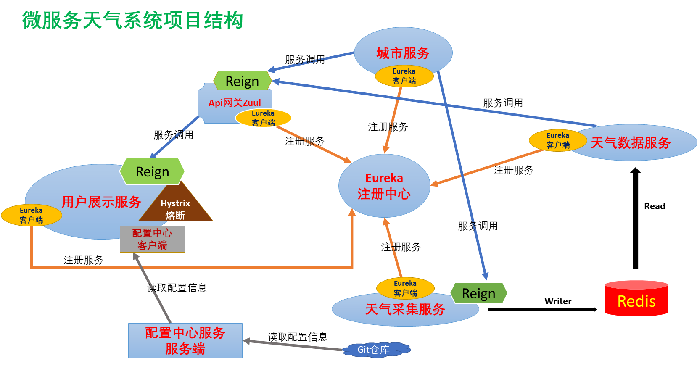

# micro-weather
微服务天气系统---Spring Cloud

版本依赖： SpringBoot2.0.0.M3 ， SpringCloud Finchley.RELEASE

<table>
  <tr>
    <td>编号</td>
    <td>模块名称</td>
    <td>介绍</td>
  </tr>
  
   <tr>
    <td>1</td>
    <td>公用信息模块  micro-weather-common</td>
    <td>存放一些实体类、vo、dto、工具类等等..</td>
  </tr>
  
  <tr>
    <td>2</td>
    <td>城市服务模块 micro-weather-city</td>
    <td>提供城市信息，（目前：从文件中获取城市列表，JSON格式）</td>
  </tr>
  
  <tr>
    <td>3</td>
    <td>天气信息采集模块 micro-weather-collection</td>
    <td>调用相关api获取天气信息，存入缓存中（项目中采用redis),每隔一段时间重复调用</td>
  </tr>
  
  <tr>
    <td>4</td>
    <td>天气api模块 micro-weather-api</td>
    <td>从缓存(redis)中获取天气信息</td>
  </tr>
  
  <tr>
    <td>5</td>
    <td>天气预报系统 micro-weather-web</td>
    <td>提供用户操作使用的图形化界面</td>
  </tr>
  
   <tr>
      <td>6</td>
      <td>服务注册中心 micro-weather-eureka-server</td>
      <td>提供服务的注册于发现</td>
    </tr>
    <tr>
      <td>7</td>
      <td>api网关 micro-weather-gateway-zuul</td>
      <td>集中管理接口</td>
    </tr>
     <tr>
          <td>8</td>
          <td>服务配置中心服务端 micro-weather-configcenter-server</td>
          <td>中心化管理配置</td>
        </tr>
  
</table>
